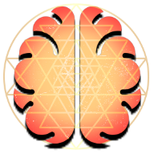

# Test for EEG browser PWA

See Web BCI test at https://webbci.netlify.app

With the latest node LTS installed, cd to where you extracted this folder from your command prompt then use the command

`npm install`

then (you may need Python and VS2017 or newer with Desktop C++ Development modules to build. You will get an error that will tell you what's missing)

`npm start`

Follow the prompt to find where the app is on your localhost server. 

## Purpose

To make a cross-platform, plug and play progressive web app interface for EEG interaction. This will later merge with my FNIRS work to make a full "Web BCI" platform. Everything is kept as modular as possible so new hardware support or interesting software features become as trivial to add as possible and without breaking anything else. 

Leveraging a developer option for chromium browsers (Chrome only currently), the Web Serial API, we can get real time data with the FreeEEG32 at the full 512sps * 32 channel sample speed. With other nice feature like web workers, gpujs, and canvas, we can make a competent and user friendly piece of software that matches functionality with others - and it can be developed in a fraction of the time.

Everything here now was accomplished over the past couple months independently, when it's done it will look like any other starter BCI software but accessible from a web link. PWAs can also be made downloadable on desktop or mobile depending on use case. This altogether makes for a flexible, rapid-development-friendly, cross platform, build-free software package to jump into the fray with our favorite hardware. I want to be able to develop something with instant cross platform access, plug and play ability, easy networking, and easy feature development. We got that with this software model, and I'll be experimenting with python and C wrappers to allow plugging those scripts into the interface for visualizing or networking with different data.

## Cool features

* GPU js FFTs with web workers enabling real time DSP for as many channel inputs as you want. Benchmarked 128 channels * 512 samples in 8.3ms, about 15ms-20ms average on an RTX 2060.
* Digital biquad filters, as many as you want...
* Live charting, brain mapping, coherence, much more to come.
* Modular data and visual tools with class based modules, and a modifiable decoder for enabling any hardware.
* Configured for the [FreeEEG32](https://github.com/neuroidss/freeeeg32_beta), easy to add other configurations, I need to add a formal layer to accept data from any kind of stream into some functions so you don't need to mess with anything else in the app.
* Wicked fast HTML rendering with custom fragment system.
* State based UI system for easy subscribing/unsubcribing disparate features to data streams. 
* Applet based feature system, easy to write features and add to the main app. The whole app is interchangable.
* IndexedDB file system with BrowserFS, download a formatted CSV, optimized for performance and not overwhelming browser memory limits by autosaving often and breaking up download file sizes into chunks.

## Javascript EEG Utilities (WIP docs as we add features)

This is still being organized and added to but the core functions are there to start doing some fun stuff with the EEG

See [signalAnalysis.md](/docs/signalAnalysis.md) for working docs

### Visual features

See the working [applets doc](/docs/applets.md) on how to add your own visual features fairly easily. There are very few restrictions on what you can do as it's all based in vanillajs. See [frontend.md](/docs/frontend.md) for a wip breakdown on how we built our front end app system. 
 
Going by packages:
* uPlot
* smoothiejs
* webglheatmap (for brainmapping)
* spectrogramjs with major modifications
* barcharts, mirrored bar charts
* timechartsjs (another webgl plotting option)

Planned:
* ThreeJS module, considering PixiJS for 2D among others
* Reintegrating HEG features from the other PWA, including the bluetooth and event sources. Websockets are easy too.
* I have a stupid simple audio system, geolocation, and a ton of other fun stuff from tinkering with the HEG we can borrow. 

Lots more, see the [TODO.txt](/TODO.txt) as well for more notes.
