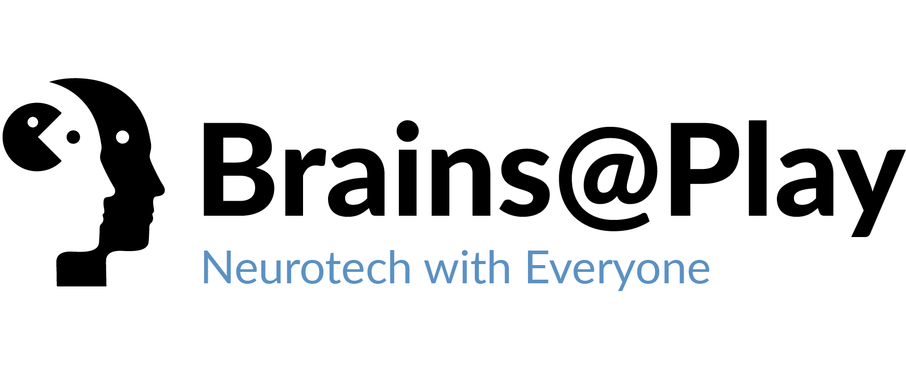

<div style="display: flex; align-items: center;  justify-content:center;margin: 25px; background: black; color: white; padding: 10px 25px;">
<div style="text-align:center; width: 100%;">

<p>The Platform for Brain-Responsive Applications</p>

<a href="https://github.com/brainsatplay/brainsatplay-beta"></a>
<a href="https://www.gnu.org/licenses/gpl-3.0"></a>
</div>
</div>

## Description
**Brains@Play** is an open-source platform for developing and deploying brain-responsive apps. 

Our software framework manages the signal acquisition, data processing, and networking requirements for creating durable brain-responsive applications so that you can focus on high-quality user experiences. 

**Status:** Alpha (give it a few weeks...)

## Getting Started

### Starting Local Development
1. Install [NPM](https://www.npmjs.com/) and [Node](https://nodejs.org/en/).
2. If you have npm installed already, make sure to update it to the latest version using:
```bash
npm update -g npm
```
2. In the project folder, install the required Node modules by typing this into your command line:
```bash
npm install
``` 
3. In your command line:
```bash
npm start
```
4. Click on the link in the terminal to navigate to http://localhost:1234 to view the latest version of Brains@Play Platform. Learn more about how to contribute your own applets [here](@tutorial Applets).

### In-Depth Tutorials
- [Creating an Applet]{@tutorial Applets}
- [Connecting to the Brainstorm]{@tutorial Brainstorm}
- [Adding a Device]{@tutorial Devices}

<!-- ### Library Usage
#### Node.js
```bash
npm install brainsatplay
``` 

##### CommonJS
```javascript
const brainsatplay = require('brainsatplay')
``` 

##### ES Modules
```javascript
import * as brainsatplay from 'brainsatplay'
```

#### Browser
```html
<script src="https://cdn.jsdelivr.net/npm/brainsatplay"></script>
``` -->

#  Examples
### [Brains@Play Platform](https://app.brainsatplay.com) 
The alpha version of Brains@Play's content management system.

## Support
If you have any questions (or would just like to chat about this project), feel free to reach out to Garrett Flynn and Josh Brewster via [contact@brainsatplay.com](contact@brainsatplay.com).


# Appendix A: The Brains@Play Ethos
Everyone has a brain. So why not develop hardware and applications with all of them in mind? Brains@Play is kickstarting a neurotechnology co-development movement where anyone can *join the brainstorm to collectively imagine how to use our brains to function better together*.

To ensure the development of accessible brain-computer interface (BCI) infrastructure, we encourage the creation of web-based [**Applets**](@tutorial Applets)<!-- (shown in the [Brains@Play Starter Kit](https://github.com/brainsatplay/brainsatplay-starter-kit) repository) -->. At the core of each Brains@Play applet is a **Data Atlas** that organizes biosignals streamed over Bluetooth Low Energy (BLE) or Serial and processes them in real-time. This allows users to **train** to modulate their brainwaves and, eventually, **play** games using the power of their minds. 

Distributing applets via the [Brains@Play Platform](https://app.brainsatplay.com) is highly encouraged—though we intend to support standalone app development in the browser and Node.js using [our NPM library](https://www.npmjs.com/package/brainsatplay). Any application built with brainsatplay.js can stream data to the [**Brainstorm**](@tutorial Brainstorm) and allow users from around the world, with varying degrees of motor control, to train and play together. 

In the coming months, our team will release **BCI Bounties** (i.e. cash prizes and community "karma") to incentivize eager contributors to solve hard problems in the neurotechnology space and make their mark on the future of neurotechnology. 

The brainstorm has begun. Will you play a part in it?