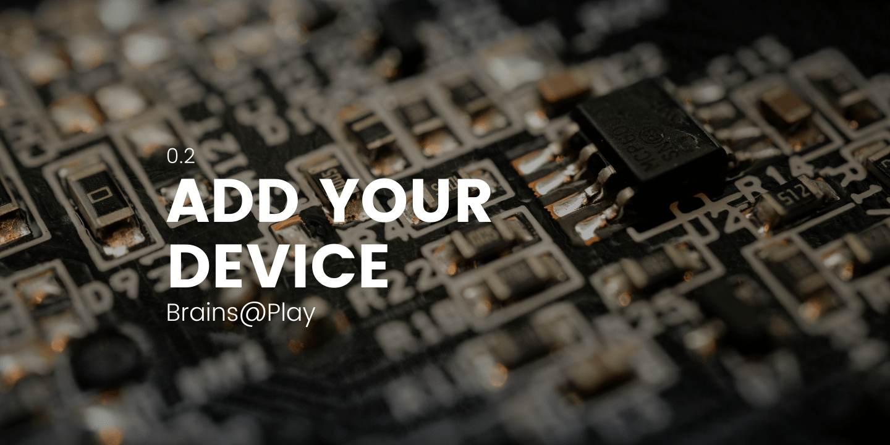

## Overview
---

This tutorial will teach you how to add support for your device to brainatplay.js.

:::note 

If your device cannot communicate directly over Serial, Bluetooth, WiFi, reference [Extend the Brainstorm](./extend-the-brainstorm) to set up a Websocket stream (or other streaming protocol) to take advantage of brainsatplay.js.

:::

## Creating a Device Plugin
---

:::tip 

All device plugins included in brainsatplay.js (including the template plugin) can be found in the `src/library/src/devices` directory. 

:::


To create a new device plugin, copy the `devicePluginTemplate.js` file and rename it. In the following example code, we'll show how the `musePlugin.js` was created.

### init()
In the `init()` function, set `info.sps` and `info.deviceType` to the correct specifications. 

``` javascript
init = (info,pipeToAtlas) => {
    info.sps = 256;
    info.deviceType = 'eeg'; // Options: 'eeg','heg','other'

    // ...
}
```

Here are some additional device properties you will have to set up in `init()`:

#### Channel Tags
``` javascript
init = (info,pipeToAtlas) => {

    // ... 

    info.eegChannelTags = [
        {ch: 0, tag: "TP9", analyze:true},
        {ch: 1, tag: "AF7", analyze:true},
        {ch: 2, tag: "AF8", analyze:true},
        {ch: 3, tag: "TP10", analyze:true}
    ];

     // ... 
}
```

**Device Drivers**
``` javascript
import { MuseClient } from 'muse-js'
// ... 

init = (info,pipeToAtlas) => {

    // ... 

    this.device = new MuseClient();

    // ...
}
```

#### Default Biquad Filters
``` javascript
init = (info,pipeToAtlas) => {

    // ... 

    if(info.useFilters === true) {
        info.eegChannelTags.forEach((row,i) => {
            this.filters.push(new BiquadChannelFilterer(row.ch,info.sps,true,1));
        });
    }

    // ...
}
```

#### Data Atlas Configuration


``` javascript
init = (info,pipeToAtlas) => {

    // ... 

    if(pipeToAtlas === true) { //New Atlas
        let config = 'muse';
        this.atlas = new DataAtlas(
            location+":"+this.mode,
            {eegshared:{eegChannelTags:info.eegChannelTags, sps:info.sps}},
            config,true,true,
            info.analysis
            );
        info.useAtlas = true;
    } else if (typeof pipeToAtlas === 'object') { //Reusing an atlas
        this.atlas = pipeToAtlas; //External atlas reference
        this.atlas.data.eegshared.eegChannelTags = info.eegChannelTags;
        this.atlas.data.eegshared.sps = info.sps;
        this.atlas.data.eegshared.frequencies = this.atlas.bandpassWindow(0,128,info.sps*0.5);
        this.atlas.data.eegshared.bandFreqs = this.atlas.getBandFreqs(this.atlas.data.eegshared.frequencies);
        this.atlas.data.eeg = this.atlas.genMuseAtlas(); 
        this.atlas.data.coherence = this.atlas.genCoherenceMap(info.eegChannelTags);
        this.atlas.settings.coherence = true;
        this.atlas.settings.eeg = true;
        info.useAtlas = true;
        if(info.analysis.length > 0 ) {
            this.atlas.settings.analysis.push(...info.analysis);
            if(!this.atlas.settings.analyzing) { 
                this.atlas.settings.analyzing = true;
                this.atlas.analyzer();
            }
        }
    }

    this.info = info;
}
```

### connect()
Customize the `connect()` function to run the connection protocol for your selected device. Leave the `onconnect()` and `setIndicator()` functions alone, as `onconnect()` is customized externally to link in with the rest of the frontend.

### disconnect()
Do the same for the `disconnect()` function. Be sure to add any exception handling you may need for connection errors.

### addControls()
The last function you may want to customize is `addControls()`, like in the case of the HEGduino which can be turned on or off or switched into different streaming modes via commands. 

## Adding Session Support
---

Now to add support to the Session frontend, open `src/library/src/Session.js` and find the `deviceStream` class. Add your device name and plugin class (be sure import it) to the this.deviceConfigs array. Then go up to `makeConnectOptions()` and add specification for the new device in the deviceOptions array with the list of device names, and then add the connect response to the `brainsatplay-${o}.onclick` function just below. You will notice that the devices here have arrays specifying things like 'eegfft' or 'eegcoherence', these are additional postprocessing algorithms you can add which will run in a separate loop and utilize our web workers. Leave the array empty for no additional processing. We are still adding more supported algorithms and optimizing what we do have so we can create a robust and automated data processing system.

> **A Note on Web Workers:**  If you want to add new analysis functions that require intensive computations, they need to be offloaded to workers. You will find eeg.worker.js in library/src/algorithms. Within this you will see a switch case list that calls different functions then reports them back generically in an object. 

Now you need to add an analyzer function to the analysis loop in DataAtlas.js. You can do this by calling `addAnalyzerFunc(name,function=()=>{})` after setting the atlas within the device plugin `init()` function. Alternatively you can add the functions to `DataAtlas.addDefaultAnalyzerFuncs()` by following the format there. These will be called every frame. For worker functions they stagger so as to not send a new worker command until the previous has returned, so intensive processes can complete and not overwhelm slower computers. 

To add worker responses you can add more if statements in `DataAtlas.workeronmessage()` to process different messages form the worker. Less intuitively you can push functions to the workerResponses array (seen in the **Data Atlas** constructor) and parse the responses according to the result in msg.foo and if the msg.origin matches, which requires a bit more internal knowledge of the framework.

## Novel Device Support
---

Brains@Play currently supports EEG and HEG hardware. For new and novel devices, there may be additional functionality to add to our **Data Atlas** so you can store and parse that data correctly. 

We suggest that you study the available plugins. As long as you match those templates as closely as possible, you will be fine. For specific questions about your own hardware, feel free to reach out to [contact@brainsatplay.com](mailto:contact@brainsatplay.com) for support.

