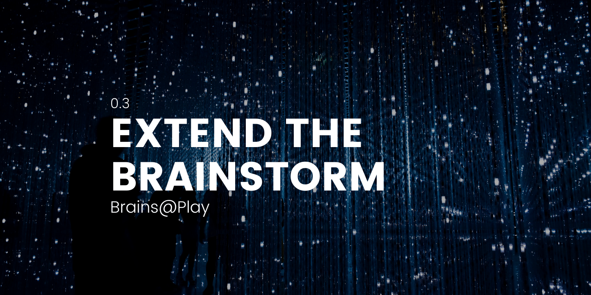
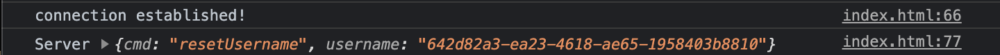

## Overview
---

While brainsatplay.js has abstracted most of the networking details for JavaScript, there's still many ways to send and receive data from the Brainstorm using other interfaces. We already support [**Python**](https://pypi.org/project/brainsatplay/0.1.0/) streaming, particularly with [**Brainflow**](https://brainflow.org/).

In this tutotial, you'll learn how to extend the Brainstorm by creating functions to manage simple Websocket messages.

:::tip
All examples were implemented as an HTML script tag—though you can implement everything using a Websocket library for (nearly) any programming language.
:::

## Websocket Basics
---

### What is Websocket?
WebSocket is a standard communications protocol allowing for persistent, bi-directional communication between a client and a server. After establishing a Websocket connection, there're only a few event handlers you'll need to specify. 

``` javascript
let connection = new WebSocket('wss://' + httpsHost, subprotocolsArray) // Alternatively, you can use 'ws:// for HTTP hosts (insecure)

connection.onopen = () => {
  console.log('connection established!')
};

// Log errors
connection.onerror = (error) => {
    console.log(`WebSocket Error: ${error}`)
};

// Log messages from the server
connection.onmessage = (e) => {
    let parsed = JSON.parse(e.data)
    console.log('Server', parsed)
};
```

### Establishing a Connection

:::note

This step is specific to the Brainstorm.

:::

To establish a connection with the Brainstorm, you'll need to pass subprotocols with basic authentication details: 

``` javascript
let username = 'guest' // Generates a random UUID
let httpsDomain = 'server.brainsatplay.com' // Or localhost:8000 if developing locally
let subprotocolsArray = [`username&${username}`,'password&','appname&'] // Authentication credentials

let connection = new WebSocket('wss://' + httpsDomain, subprotocolsArray)

// ...

```
With these changes, you should recieve the following message in the Chrome developer console: 



Note that our username will be passed back from the server as a universally unique identifier (UUID) when left undeclared or specified as `guest`.

### Handle Server Responses
Now that you're receiving messages from the server, it's time to interact with these messages and fruitfully engage with the Brainstorm. 

Before things get too complicated, let's update our username with the returned UUID:

``` javascript
connection.onmessage = (e) => {
    let parsed = JSON.parse(e.data)
    console.log('Server', parsed)

    if (parsed.msg == 'resetUsername'){
        username = parsed.username // Replace existing username with UUID
    } else {
        console.log(`Unhandled command: ${parsed.msg}`)
    }
```

While this example is extremely simple, we'll later implement more complex functionality using the exact same pattern of chained if-statements. 

Before we dive into the details, however, you should know how to send messages to the Brainstorm.

### Sending a Message
Sending a WebSocket message is as simple as calling `.send()` on the WebSocket object. While you can format your message in serveral different ways, it should always be passed as a JSON string and include your username as the first parameter:

``` javascript

connection.onmessage = (e) => {
let parsed = JSON.parse(e.data)
    console.log('Server', parsed)

    if (parsed.msg == 'resetUsername'){
        username = parsed.username // Replace existing username with UUID
        
        // Format Option #1: Dictionary
        let msg = {username: username, cmd: 'ping'}
        connection.send(JSON.stringify(msg))

        // Format Option #2: Array
        connection.send(JSON.stringify([username,'ping']))

        // Format Option #3: String
        connection.send(JSON.stringify(`${username} ping`))

    } else {
        console.log(`Unhandled message: ${parsed.msg}`)
    }

}
```

After choosing one of these methods, you should recieve the following message in the Chrome developer console: 


## Brainstorm Commands
---

Now that you know the basics of sending and receiving messages via the Websocket protocol, it's time to dive into the details of interfacing with the Brainstorm. 

The basic commands that can be sent to the Brainstorm are as follows:

### User Subscriptions
#### getUserData
Check if you can subscribe to a specific user.

``` javascript
let msg = {
    username: myUsername,
    cmd: ['getUserData',otherUsername]
}
```

Returns `getUserDataResult` OR `userNotFound`

#### subscribeToUser
Subscribe to the specified user's data.
``` javascript
let msg = {
    username: myUsername,
    cmd: ['subscribeToUser',myUsername,otherUsername,userProps]
}
```

#### unsubscribeFromUser
Unsubscribe from the specified user's data.

``` javascript
let msg = {
    username: myUsername,
    cmd: ['unsubscribeFromUser',myUsername,otherUsername,userProps]
}
```

Returns `unsubscribed`

### App Subscriptions
### getSessions
Request details about all active sessions of an app on the Brainstorm.

``` javascript
let msg = {
    username: username,
    cmd: ['getSessions',appname]
}
```

returns `getSessionsResult` or `appNotFound`

### createSession
This creates a new session of an app with specific device and data requirements.

``` javascript
let msg = {
    username: username,
    cmd: ['createSession',appname,devices,streams]
}
```

returns `sessionCreated`

### getSessionInfo
Request details about a particular session of an app on the Brainstorm. This is used to check whether the user has the correct streaming parameters and devices for the session.

``` javascript
let msg = {
    username: username,
    cmd: ['getSessionInfo',sessionid]
}
```

returns `getSessionInfoResult` or `sessionNotFound`

### subscribeToSession
This tells the Brainstorm to begin streaming live data from this session to your client.

``` javascript
let msg = {
    username: username,
    cmd: ['subscribeToSession',username,sessionid,spectating]
}
```

### leaveSession
This tells the Brainstorm to stop streaming live data from this session to your client.

``` javascript
let msg = {
    username: username,
    cmd: ['leaveSession',sessionid]
}
```

returns `leftSession`

### addProps
This defines expected data parameters from the user for server-side reference. Overrides properties specified via the `createSession`command.

``` javascript
let msg = {
    username: username,
    cmd: ['addProps',propsToSend]
}
```

## Streaming Data
---

Once subscribed to an app session (i.e.`subscribeToSession`) with `spectating = false`, it's as easy as sending a message containing a `userData` field to the Brainstorm. Since this is a real-time stream, this should be contained in some sort of loop:

``` javascript

let animate = () => {

    msg = {username: username, userData: {param: 'value'}}
    connection.send(JSON.stringify(msg))

    window.requestAnimationFrame(animate)
}

animate()
```

For optimal performance, restrict your application to only stream new data! 

## Parsing Data Streams
---

Now that you're streaming data, how can you parse the returned stream from the Brainstorm? Whether you're subscribed to a particular user or a app session, you can parse the returned data in the same way.

Here's a simple implementation in JavaScript:

``` javascript
connection.onmessage = (e) => {
let parsed = JSON.parse(e.data)
    console.log('Server', parsed)

    if(parsed.msg === 'userData') {
        for (const prop in parsed.userData) {
            console.log('prop', parsed.userData[prop])
        }
    }
    else if (parsed.msg === 'sessionData') {
        parsed.userData.forEach((o,i) => {
            let user = o.username                
            console.log(`Data for ${user}`)
            for(const prop in o) {
                console.log('prop', o[prop])
            }
        });
    } else if // ...
}
```


## Conclusion
---

We're so glad you're interested in extending the Brainstorm to reach new interfaces and end-users! For specific questions about your own goals, feel free to reach out to [contact@brainsatplay.com](mailto:contact@brainsatplay.com) for support.


