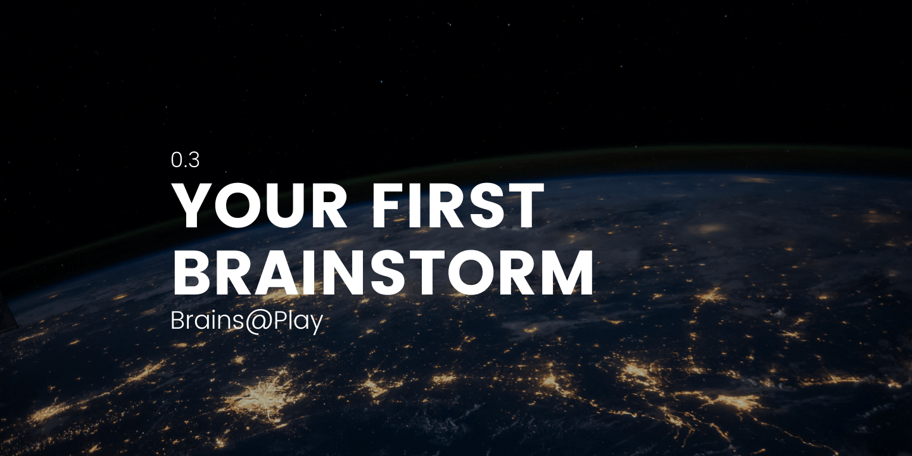
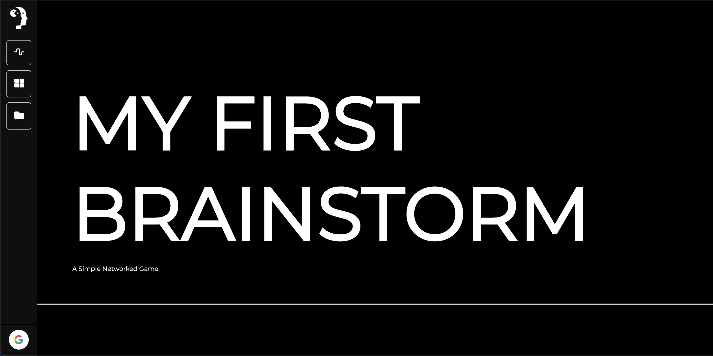
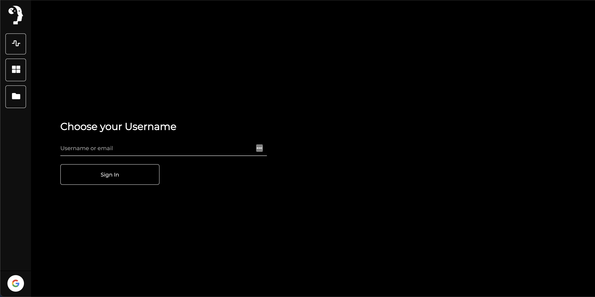
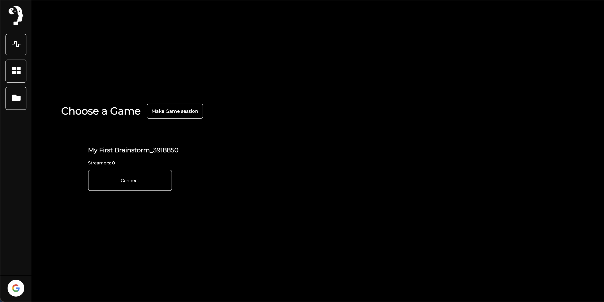
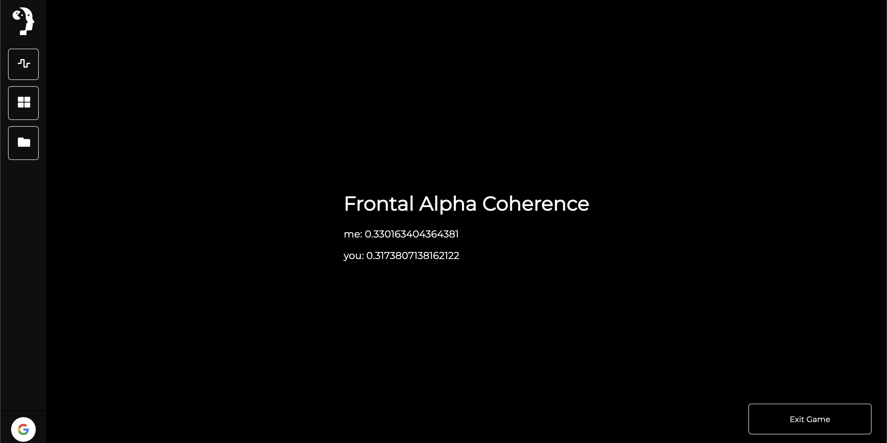
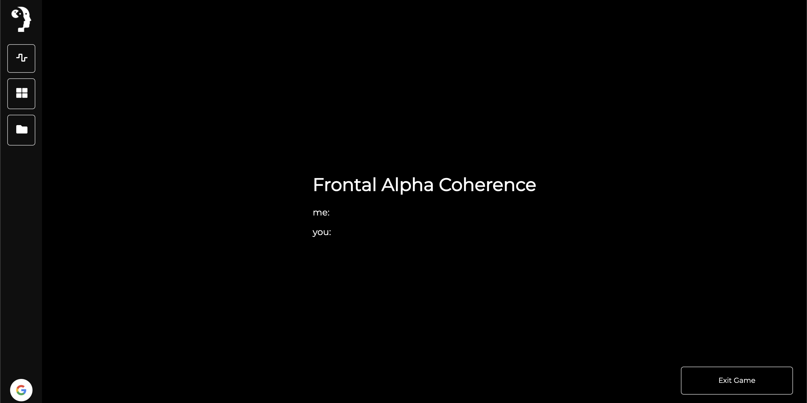
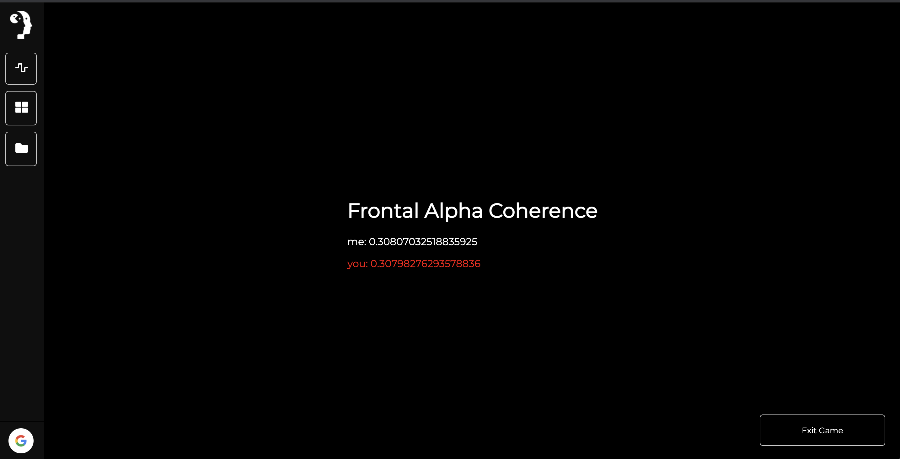

## Overview
---

This tutorial will get you started building your first networked application with brainsatplay.js! 

## Welcome to The Brainstorm
---

### Update your Settings
Before we begin, update your settings file to tag your applet with the `brainstorm` category tag.

``` javascript
export const settings = {
    
    // ...

    "categories": ["train","brainstorm"], // Add the 'brainstorm' category

    // ...
}

```

### Add Default Intro Sequence
To make it easier for developers to create a fully-functional networked game, we've provided a helper function to automate the process of (1) presenting a welcome screen, (2) choosing a username, and (3) selecting an available game session: 

``` javascript
constructor(){

    // ...

    //-------Required Multiplayer Properties------- 
    this.subtitle = 'A Simple Networked Game' // Specify a subtitle for the title screen
    this.streams = ['coherence'] // Register your app data streams
    //----------------------------------------------
    
    // ...

}

init(){

    /// ...

    //HTML UI logic setup. e.g. buttons, animations, xhr, etc.
    let setupHTML = (props=this.props) => {
        this.session.insertMultiplayerIntro(this)
    }

    ///...

}
```

After implementing the above code, you should be able to navigate through the default intro sequence on your applet:





## Listen to the Brainstorm
---

Instead of checking your **Data Atlas** inside the `animate()` function, you'll now iterate through the data from `this.session.getBrainstorm()`. Let's also chane how we're updating the HTML to support more than one user's data.

``` javascript
init() {

    // ...

    let animate = () => {
        let userData = this.session.getBrainstormData(this.info.name)
        if (userData){
            let html = ''
            userData.forEach((data)=> {
                html += `<p>${data.username}: ${data.coherence}</p>`
            })
            document.getElementById(`${this.props.id}-coherence`).innerHTML = html
        } 

        setTimeout(this.animation = window.requestAnimationFrame(animate),1000/60)
    }
}
```

Now, if you use two Chrome windows to connect synthetic streams from different usernames, you should see `userData` passed between these clients on the coherence readout:



But, you may be asking yourself, where's the coherence data?!


## Adding a Data Stream
---

In this cases, you'll want to automatically compute and stream data to the Brainstorm. To do this, add a custom streaming function using `this.session.addStreamFunc()`. 

Specifically, you'll want to pass the function that we used to compute frontal alpha coherence:

``` javascript

init() {

    // ...

    this.session.addStreamFunc(
        'coherence', 
        () => {
            return this.session.atlas.getCoherenceScore(this.session.atlas.getFrontalCoherenceData(),'alpha1')
        }
    )

    let animate = () => {
        // ...
    }
}
```

Now let's check out our applet again:



If everything has gone smoothly, you should now see coherence values passed between your simulated clients!


## Adding an App Stream
---

You can also add an app stream to send data/events (e.g button clicks, player health, etc.) over the Brainstorm. 

To take advantage of this functionality, you'll have to create a Javascript object to hold the data you'd like to pass:

``` javascript
constructor(){
    
    /// ...

    this.stateIds = []
    this.appEvents = {
        spacebar: false
    }

}

// ...

deinit(){

    this.stateIds.forEach(id => {
        this.session.state.unsubscribeAll(id);
    })

    // ...
}
```

The app will listen for changes to this object and send them through the Brainstorm to other users. But first, we have to register the object in our app:


``` javascript
constructor(){

    // ...

    this.streams = ['coherence','appEvents'] // Register your app data streams
    
    // ...

}

init() {

    // ...

    this.stateIds.push(this.session.streamAppData('appEvents', this.appEvents,(newData) => {console.log('new data!')}))

    let animate = () => {
        // ...
    }
}
```

Since we've added a new stream parameter to the app, you'll have to (1) create a new Game Session or (2) restart the server for this change to take effect. 

After this, you can now change the `appEvents` variable and it will be automatically updated in the app stream. Let's change the color of each user's text when they press the spacebar!

``` javascript

init() {

    // ...

    document.addEventListener('keydown',this.handleKeyDown)

    document.addEventListener('keyup',this.handleKeyUp)

    let animate = () => {

        // ...

        userData.forEach((data)=> {
            let inlineStyle = (data.appEvents?.spacebar ? "color: red;" : "")
            html += `<p style="${inlineStyle}">${data.username}: ${data.coherence}</p>`
        })
        
        // ...

    }
}

deinit(){
    // ...

    document.removeEventListener('keydown',this.handleKeyDown)
    document.removeEventListener('keyup',this.handleKeyDown)
}

handleKeyDown = (k) => {
    if (k.code === 'Space' && this.appEvents.spacebar != true) this.appEvents.spacebar = true
}

handleKeyUp = (k) => {
    if (k.code === 'Space') this.appEvents.spacebar = false
}

```

Press the spacebar to change the text color across different clients!



## Conclusion
---

You should now have an applet that passes (1) frontal alpha coherence and (2) spacebar clicks to all users connected to your app session on the Brainstorm! 

**We challenge you to customize this default UI and create a game with the above mechanics.** What will you create?