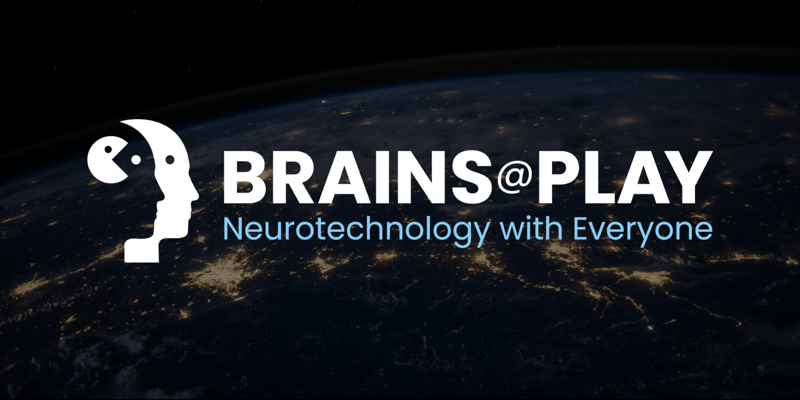

## Welcome to The Biosensing Game
---

**[Brains@Play](https://app.brainsatplay.com) is an AGPL-licensed JavaScript framework allowing anyone to leverage biosignals for data collection, feedback, and control in modern web applications.** Check out our  [main Github repository](https://github.com/brainsatplay/brainsatplay) to contribute to our codebase.

<!-- ADD A HIGHLIGHT REEL VIDEO -->

1. Platform (https://app.brainsatplay.com)
2. Studio (https://app.brainsatplay.com/#studio)
3. Library (https://github.com/brainsatplay/brainsatplay)

You should consider using Brains@Play if you're looking to:
- Distribute a complete biosensing app on the Web
- Rapidly design a Web interface for your native biosensing application
- Support social connection and/or remote data collection through a networked biosensing app

## Getting Started
---

We're so excited to have you as part of the Brains@Play community! Head over to [**Setup**](./getting-started/setup) to clone our Github repository and begin participating in the future of neurotechnology!

### Build an Application
Head over to **Getting Started** to learn how to build your first application with brainsatplay.js.

### Expand the Ecosystem 
Explore **Advanced Topics** to begin extending the functionality of brainsatplay.js for other developers.

### Brainstorm with the Community
Discover **Community Projects** to build on top of.

### Explore the Reference
Extensive references to the brainsatplay.js software library can be found on our [**Reference**](./reference) page.

### Ask for Help
If you have questions about developing with Brains@Play, feel free to start a conversation on [Discord](https://discord.gg/tQ8P79tw8j) or reach out directly to our team at [contact@brainsatplay.com](mailto:contact@brainsatplay.com).

### Provide your Feedback
To provide feedback on the documentation, create new issues at [brainsatplay/brainatplay](https://github.com/brainsatplay/brainsatplay). If you have brainsatplay.js questions, or issues with the codebase, please open new issues at [brainsatplay/brainatplay](https://github.com/brainsatplay/brainsatplay) as well.