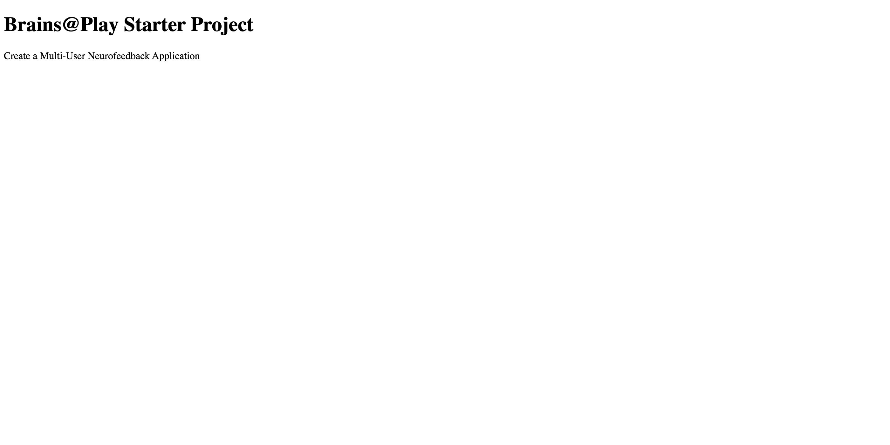
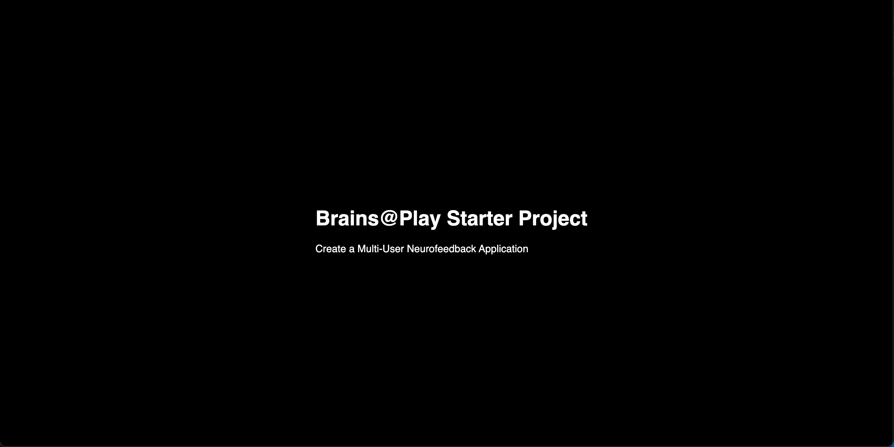
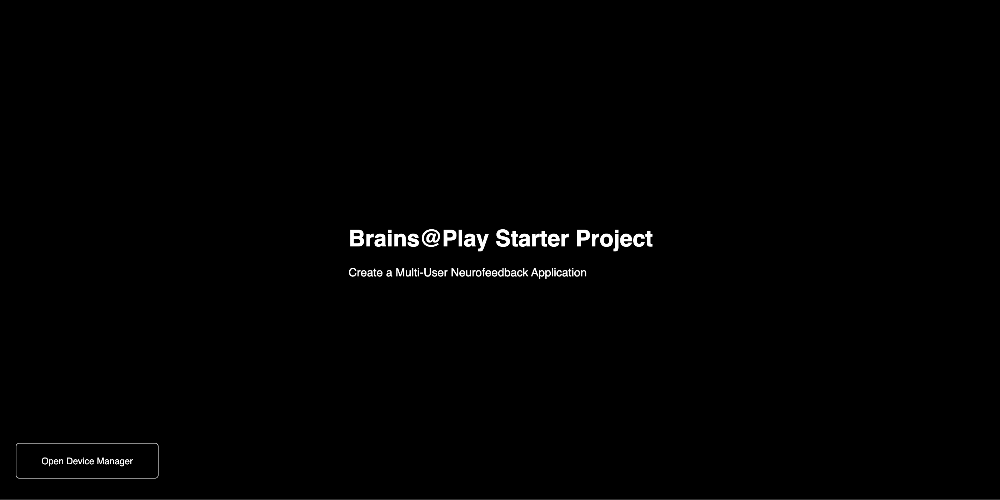

<!-- ## Overview
--- -->
This tutorial series will guide you through the creation of a multi-user neurofeedback application with Brains@Play.

## Sections
1. Building a Multiplayer Neurofeedback Application (video)
    - High-performance graphing system
    - Buttons to swap data (1) looked at and (2) saved
2. Extending the Neurofeedback Plugin (video)


:::note 

The final product of this tutorial is located in the [Brains@Play Starter Project](https://github.com/brainsatplay/brainsatplay-starter) repository on our Github page.

:::

## Setting Up a Project
Open up your favorite code editor (we recommend [Visual Studio Code](https://code.visualstudio.com/)) and create a new project. This is where you'll create new files as you follow along with this tutorial.

To begin your journey though Web development, you'll have to become familiar with three different languages: HyperText Markup Language (HTML), Cascading Style Sheets (CSS), and JavaScript. 

### HTML
**HTML** is a standard markup language used to structure the content of a web page. This is composed of HTML elements declared with a start tag, content, and end tag.

To get familiar with HTML, let's create an `index.html` file with the following content:

``` html title="index.html"
<!DOCTYPE html> <!-- Declare that this document is an HTML5 document -->
<html lang="en"> <!-- The root element of an HTML page -->
    <head> <!-- Contains metainformation about the Web page -->
        <title>Brains@Play Starter Project</title> <!-- Specify the title for the page (shown in the browser's title bar or page tab-->
    </head>
    <body> <!-- The container for all visible content on a page -->
        <div id='application'> <!-- An HTML element to define a generic container. -->
            <div>
                <h1>Brains@Play Starter Project</h1> <!-- An HTML element to define a large heading -->
                <p>Create a Multi-User Neurofeedback Application</p> <!-- An HTML element to define a paragraph -->
            </div>
        </div>
    </body>
</html>
```

When you open this file (we recommend using the VSCode [Live Server](https://marketplace.visualstudio.com/items?itemName=ritwickdey.LiveServer) extension), you'll see the following page:



Congratulations, you've created your first Web page! Yet while we have text on the screen, it isn't very pretty. 

### CSS
**CSS** is a simple way to add style (e.g. fonts, color, etc.) to your Web page. Create a `style.css` file with the following content: 

``` css title="style.css"
body {
    font-family: Montserrat, sans-serif; /* Specify a font to use in the whole document */
    color: white; /* Specify text color for the whole documentt */
    background: black; /* Specify background color for the whole documentt */
    width: 100vw; /* Specify width of the element relative to the viewport */
    height: 100vh; /* Specify height of the element relative to the viewport */
}

#application {
    width: 100%; /* Specify width of the element relative to the parent element */
    height: 100%; /* Specify height of the element relative to he parent element */
    display: flex; /* Declare that Flexbox should be used (responsive elements inside the container) */
    align-items: center; /* Specify where to vertically align items in the Flexbox */
    justify-content: center; /* Specify where to horizontally align items in the Flexbox */
}
```

Additionally, we'll have to link this stylesheet in the head of our HTML document using a `<link>` tag.

``` html title="index.html"
<!---->

    <head>
        <title>Brains@Play Starter Project</title>
        <link rel='stylesheet' href='./style.css'> <!-- Link the specified file to the HTML document-->
    </head>

<!---->
```

Now that we've added some style to our Web page, it looks something like this:



Great! Now that our page is looking stylish, let's actually start programming a Brains@Play application. 

### JavaScript

Brains@Play is entirely written in **JavaScript**: the programming language of the Web. To begin working with the Brains@Play library, we'll have to import it using a `<script>` tag. 

At this time, we'll also create an `index.js` file and import this into our HTML document.

``` html title="index.html"
<!---->

    <head>
        <title>Brains@Play Starter Project</title>
        <link rel='stylesheet' href='./style.css'>
        <script src="https://cdn.jsdelivr.net/npm/brainsatplay@0.0.12"></script> <!-- Import the Brains@Play library from a content delivery network -->
        <script src="./index.js" type="module"></script> <!-- Import a local JavaScript file into our project -->
    </head>

<!---->
```

As Brains@Play is modular, we've imported the `index.js` file as a **module**. This allows us to take advantage of the `import` and `export` statements and ensure that your code can be immediately contributed to our software library itself!

Now let's open our `index.js` file and embed an empty Brains@Play application into our document.

``` javascript title="index.js"
let app =  new brainsatplay.App() // Create an app
app.init() // Initialize the app and add it to the HTML document
```

By embedding an empty application into your document, not much has happened. A button has simply been placed into your document, which will open the **Brains@Play Device Manager** for users to connect their biosensing device. 



To do more than this, we'll have to dig into the architecture of a Brains@Play Application.

:::note 

If something isn't working, you can open the [Developer Console](https://balsamiq.com/support/faqs/browserconsole/) on your browser to debug any errors.

:::

## Conclusion
Congratulations on creating your first web page incorporating the Brains@Play software library! 

In the [next tutorial](./your-first-applet), you'll learn how to design a simple neurofeedback application using the `graph` field of the settings file.
