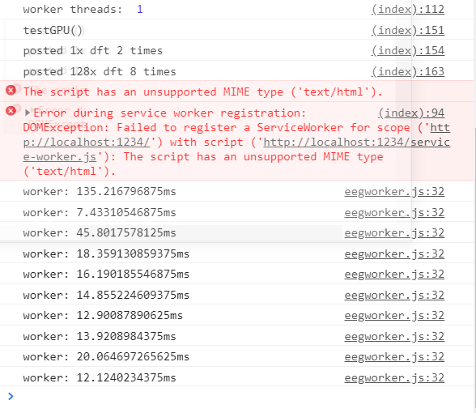

## Signal Analysis tools

We're in deep here. So I had to solve the problem of having a library that could process an arbitrary number of FFTs and other things and still leave room for everything else, which means GPU code - and good GPU code. Then I had the problem of well how do I write good GPU code because even webgl with uniforms and buffering and all that just blows my mind up even after 3 years of tinkering with graphics and taking a class (that I absolutely sucked at). That's where the miracle of gpu.js comes in. This bit actually took me a few months of coming back to it to solve even with gpujs. 

Once I got the FFTs working en masse I still had to offload that to a web worker thread to make it viable along with a real time front end, but thankfully gpujs comes prepared with offscreencanvas for workers. This is what made this whole software possible and properly scalable. I wasn't going to do it any other way, and no other libraries could meet the demands for the FreeEEG32 especially when we introduce coherence between all channels, totalling a few hundred FFTs and cross-correlations. And that's still nothing for what we can do with this framework if we optimize it more since we can pipeline.

#### eeg32 in src/js/eeg32.js

* Contains all necessary functions to connect to, parse, and organize the FreeEEG32 data.
* Boyer-moore search for lightning fast byte processing (all hail stackoverflow)
* Decoders can be written for any hardware with serial output and used seamlessly with the rest of the API.
* Increasing number of simple but essential signal analysis functions.

eeg32 class instance functions:

`var eegclass = new eeg32(onDecodedCallback, onConnectedCallback, onDisconnectedCallback, CustomDecoder, baudrate);`

* `eegclass.setupSerialAsync()` - asks for your serial port.

There are a couple handlers you can customize on init (or at any time) in the serial streaming to handle updates on the front end.
* `eegclass.onDecoded = () => {console.log("decoded!");}`
* `eegclass.onConnectedCallback = () => {console.log("port connected!");}`
* `eegclass.onDisconnectedCallback = () => {console.log("port disconnected!");}`
* `eegclass.decode = (buffer) => {//byte or string decoding protocol here.}`
Set these all on init, including a custom baudrate if needed (it automatically picks 115200)

`var Atlas = new eegAtlas(defaultTags)`

* `Atlas.makeAtlas10_20()` - makes an MNI atlas with tags for standard 10_20 electrode placements. It contains a data substructure for organizing channel FFT data.
* `Atlas.newAtlas(tags,coords)` - make a new MNI atlas with the tags and 3D coords via an array of Array(3)'s. 

There is much more here not documented yet, like a separate map just for coherence data (which is channel to channel coherence with a different tagging system).

Static functions in eegmath class:
* `eegmath.genSineWave(frequency, amplitude, seconds, sampleRate, frequency2 (optional), amplitude2 (optional));` - generates a sine wave of the given frequencies, with array length equal to sampleRate * seconds. Frequency 2 is optional e.g. for simulating simple noise.
* `eegmath.cov2d(mat)` - 2D matrix covariance, pretty fast! 
* `eegmath.cov1d(arr1,arr2)` - 1D covariance between two arrays. It's simply a macro for cov2d.
* `eegmath.crosscorrelation(arr1,arr2)` - returns the cross-correlogram for the two input signals
* `eegmath.autocorrelation(arr1)` - returns the auto-correlogram for the input signal
* `eegmath.sma(array, window)` - returns an array of the simple moving average based on the window sample size
* `eegmath.mean(array)` - reduces an array to the mean (expected value)
* `eegmath.variance(array)` - returns the variance array of the input array
* `eegmath.transpose(mat)` - 2D matrix transposing for quick maths
* `eegmath.matmul(mat1,mat2)` - 2D matrix multiplication
* `eegmath.correlograms(dat)` - Input an array of signals of same length and output the auto and cross correlograms in ascending order.
* `eegmath.interpolateArray(data,fitCount)` - Lets you resize your data arrays. This is integrated into the spectrogram for instance to scale the data to the height of the canvas pixels no matter what the input is.

#### gpuUtils in src/js/utils/gpuUtils.js

* gpu.js based utilities. It's easy enough for my brain to handle
* This does the bulk of the computation work and eats FFTs for breakfast. Accomplished 128 channels * 2048 samples (4 seconds) in 50ms, averages about 70ms runtime in single thread, 20ms in worker threads on RTX 2060 but even works on super old laptops
* I'll try to port the autocorrelation and cross correlation functions in to do mass numbers of them in parallel (e.g. for mapping coherence networks)

`var gpu = new gpuUtils()`

* `gpu.gpuDFT(signalBuffer, nSeconds, texOut = false)` - Single channel DFT, give it a 1D array with the number of seconds of data captured and it will return a 2D array, the first index is a list of the frequency distribution (x-axis) of each amplitude, the second index is the array of amplitudes up to a max of the sample rate / 2 (the nyquist frequency of the sampling rate). 

* `gpu.MultiChannelDFT(signalBuffer, nSeconds, texOut = false)` - Multi channel DFT, input a 2D array with rows of equal widths and the number of seconds sampled. Outputs a 2D array with the frequency distribution (x-axis) in the first index and then the list of amplitudes in the second index.

* `gpu.MultiChannelDFT_Bandpass(signalBuffer, nSeconds, freqStart, freqEnd, texOut = false)` - Multi channel DFT with a bandpass filter applied. Input 2D array with rows of equal widths, number of seconds, high pass frequency (lower bound), and low pass frequency (upper bound). Just set the filter to maximum nyquist sampling frequency for no low-pass filtering. Outputs a 2D array with the band pass window frequency distribution in the first index and the list of -positive- amplitudes in the next index.

* More being tested like inverse DFTs, full gpu-based coherence, multiprocess pipelining, and then some. gpujs lets you pass textures of the outputs between kernels with ease which lowers the difficulty for real time DSP with big data sets by  a huge margin. There are also tests in the /other folder e.g. for video convolution or the 128 channel FFT benchmark

#### Benchmark on RTX 2060 using eegworker.js:

##### 128 channels, 512sps, 1 second of data with bandpass filter: 8.3ms fastest, 20ms average.

##### 1 channel, 512sps, 1 second of data: 1.9ms fastest, 3.5ms average

