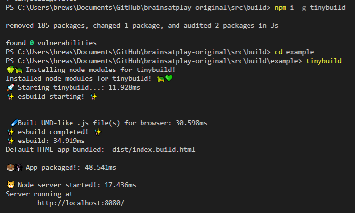

# tinybuild
Minimal [esbuild](https://esbuild.github.io/getting-started/#your-first-bundle), [Nodejs](https://developer.mozilla.org/en-US/docs/Learn/Server-side/Node_server_without_framework), and [Python Quart](https://pgjones.gitlab.io/quart/) concurrent build and test env.  

 


### [Quickstart](docs/tinybuild.md)
### [esbuild app and library bundling](docs/esbuild.md)
### [Node development/production server](docs/server.md)
### [Python development/production server](docs/python.md)




`npm i -g tinybuild`. If using this source, `npm i -g`

then from an empty project folder, initialize a default app with:

`tinybuild`

Or first create a tinybuild.config.js like so:
```js
//import {defaultBundler, defaultServer, packager} from 'tinybuild'

const config = {
    bundler: { //esbuild settings, set false to skip build step or add bundle:true to config object to only bundle (alt methods)
        entryPoints: [ //entry point file(s). These can include .js, .mjs, .ts, .jsx, .tsx, or other javascript files. Make sure your entry point is a ts file if you want to generate types
        "index.js"
        ],
        outfile: "dist/index", //exit point file, will append .js as well as indicators like .esm.js, .node.js for other build flags
        //outdir:[]               //exit point files, define for multiple bundle files
        bundleBrowser: true, //create plain js build? Can include globals and init scripts
        bundleESM: false,  //create esm module js files // { platform:'node' } //etc you can also supply an object here to add more specific esbuild settings
        bundleTypes: false, //create .d.ts files //you need a .tsconfig for this to work
        bundleNode: false, //create node platform plain js build, specify platform:'node' to do the rest of the files 
        bundleHTML: false, //wrap the first entry point file as a plain js script in a boilerplate html file, frontend scripts can be run standalone like a .exe! Server serves this as start page if set to true.
        minify: true,
        sourcemap: false
        //globalThis:null //'mymodule'
        //globals:{'index.js':['Graph']}
        //init:{'index.js':function(bundle) { console.log('prepackaged bundle script!', bundle); }}      
     },
    server: {  //node server settings, set false to skip server step or add serve:true to config object to only serve (alt methods)
        debug: false,
        protocol: "http",  //'http' or 'https'. HTTPS required for Nodejs <---> Python sockets. If using http, set production to False in python/server.py as well
        host: "localhost", //'localhost' or '127.0.0.1' etc.
        port: 8080, //e.g. port 80, 443, 8000
        startpage: "index.html", //home page
        socket_protocol: "ws", //frontend socket protocol, wss for served, ws for localhost
        hotreload: 5000,  //hotreload websocket server port
        //watch: ['../'], //watch additional directories other than the current working directory
        pwa: "dist/service-worker.js",  //pwa mode? Injects service worker registry code in (see pwa README.md)
        python: false,//7000,  //quart server port (configured via the python server script file still)
        python_node: 7001, //websocket relay port (relays messages to client from nodejs that were sent to it by python)
        errpage: "node_modules/tinybuild/tinybuild/node_server/other/404.html",  //default error page, etc.
        certpath: "node_modules/tinybuild/tinybuild/node_server/ssl/cert.pem", //if using https, this is required. See cert.pfx.md for instructions
        keypath: "node_modules/tinybuild/tinybuild/node_server/ssl/key.pem" //if using https, this is required. See cert.pfx.md for instructions
    }
}


export default config;
```

Then run `tinybuild`.

### tinybuild commands:

`tinybuild help` lists accepted arguments, see the boilerplate created in the new repo for more. The `tinybuild` command will use your edited `tinybuild.config.js` or `tinybuild.js` (which includes the library and executes the packager with the bundler and/or server itself for more control) config file after initialization so you can use it generically, else see the created `package.json` for more local commands.

global command:
- `tinybuild` -- runs the boilerplate tinybuild bundler + server settings in the current working directory. It will create missing index.js, package.json (with auto npm/yarn install), and tinybuild.js, and serve with watched folders in the working directory (minus node_modules because it slows down) for hot reloading.

local command:
- `node path/to/tinybuild.js` -- will use the current working directory as reference to run this packager config

tinybuild arguments (applies to packager or tinybuild commands):
- `start` -- runs the equivalent of `node tinybuild.js` in the current working directory.
- `bundle` -- runs the esbuild bundler, can specify config with `config={"bundler":{}}` via a jsonified object
- `serve` -- runs the node development server, can specify config with `config={"server":{}}` via a jsonified object and object
- `mode=python` -- runs the development server as well as python which also serves the dist from a separate port (7000 by default). 
- `mode=dev` for the dev server mode (used by default if you just type `tinybuild` on boilerplate)
- `path=custom.js` -- target a custom equivalent tinybuild.js entry file (to run the packager or bundler/server)st` - host name for the server, localhost by default

esbuild arguments:
- `entryPoints=index.js` -- set an entry point for your script, can also be a JSONified array of strings.
- `outfile=dist/index` -- set the output directory and file name (minus the extension name)
- `outdir=['dist/index']` -- alternatively use outdir when using multiple entry points
- `bundleBrowser=true` -- produce a plain .js bundle that is browser-friendly, true by default. 
- `bundleESM=false` -- produce an ESM module bundle, false by default, Will be identified by .esm.js
- `bundleTypes=false` -- produce .d.ts files, false by default, entry point needs to by a typescript file but it will attempt to generate types for js files in the repo otherwise. The files are organized like your repo in the dist folder used. 
- `bundleNode=false` -- create a separate bundle set to include node dependencies. Identified by .node.js
- `bundleHTML=true` -- bundle an HTML boilerplate that wraps and executes the browser bundle as a quick test. If true the packager command will set this file as the startpage, otherwise you have an index.html you can customize and use that has the same base boilerplate. Find e.g. index.build.html in dist.
- `external=['node-fetch']` -- mark externals in your repo, node-fetch is used in a lot of our work so it's there by default, the node bundle has its own excludes (see our esbuild options in readme)
- `platform=browser` -- the non-node bundles use browser by default, set to node to have all bundles target the node platform. Externals must be set appropriately.
- `globalThis=myCustomBundle` -- You can set any exports on your entry points on the bundleBrowser setting to be accessible as a global variable. Not set by default.
- `globals={[entryPoint]:['myFunction']}` -- you can specify any additional functions, classes, variables etc. exported from your bundle to be installed as globals on the bundleBrowser setting.

Server arguments:
- `host=localhost` -- set the hostname for the server, localhost by default. You can set it to your server url or IP address when serving. Generally use port 80 when serving.
- `port=8080` - port for the server, 8080 by default
- `protocol=http` - http or https? You need ssl cert and key to run https
- `python=7000` - port for python server so the node server can send a kill signal, 7000 by default. Run the python server concurrently or use `mode=python`
- `hotreload=5000` - hotreload port for the node server, 5000 by default
- `watch=../../path/to/other/src` OR `watch=['path/to/src1','src2','.xml']` - watch extra folders and extensions
- `extensions=xml,3ds` OR `extensions=['xml','3ds']` watch specific extensions for changes
- `ignore=../../path/to/other/src,path2/src2` OR `ignore=['path/to/src1','../path2/src2']`- ignore files and folders
- `startpage=index.html` - entry html page for the home '/' page, index.html by default
- `certpath=tinybuild/node_server/ssl/cert.pem` - cert file for https 
- `keypath=tinybuild/node_server/ssl/key.pem` - key file for https
- `pwa=tinybuild/pwa/workbox-config.js` - service worker config for pwa using workbox-cli (installed separately via package.json), the server will install a manifest.json in the main folder if not found, https required
- `config="{"server":{},"bundler":{}}"` -- pass a jsonified config object for the packager. See the bundler and server settings in the docs.
- `init` -- initialize a folder as a new tinybuild repository with the necessary files, you can include the source using the below command
- `core=true` -- include the tinybuild source in the new repository with an appropriate package.json
- `entry=index.js` --name the entry point file you want to create, defaults to index.js
- `script=console.log("Hello%20World!")` -- pass a jsonified and URI-encoded (for spaces etc.) javascript string, defaults to a console.log of Hello World!


### Other notes:

See README.md files in each subfolder for more explanation on how to work with these types of applications.
