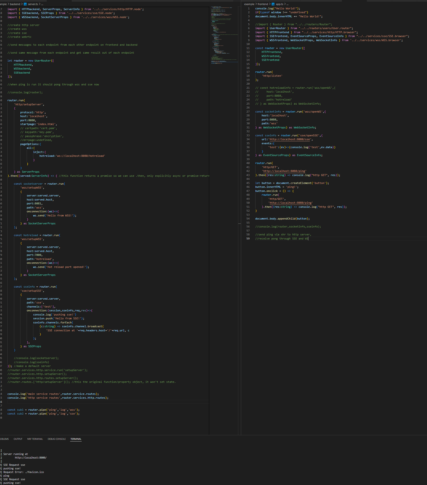

# READMEs (WIP):

## * [Graph](./docs/Graph.md)
## * [Service](./docs/Service.md)
## * [Router](./docs//Router.md)

This is the new Brains@Play core, which seeks to be a true graph based programming api and unified interface for microservices and otherwise automating major frontend and backend execution needs with minimal mental work (once you learn the basics).

[exg](./docs/graphex.png)

The core stack of classes are as follows:
### * [Graph](./Graph.ts) 
GraphNode and Graph
### * [Service](./services/Service.ts)
### * [Router](./routers/Router.ts)
### * [UserRouter](./routers/users/UserRouter.ts)

This is kind of a bloated example right now but this is actively being used to test bugs and think even bigger for the framework:

Joshua Brewster and Garrett Flynn

AGPL v3.0 License (copyleft)